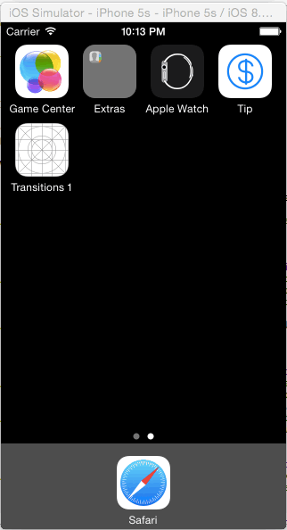

Tip-Calculator
==============

A tip calculator created as the pre-work for CodePath iOS for Designers class. 

### Time Spent
* 30 min for basic calculator
* 2 - 3 hours refining the design
* 4 hours figuring out and debugging the animations and optional features

### User Stories
* Basic calcuator with 3 tabs
* Swipe right to clear the bill
* Added a placeholder '$0' for bill, and prefix '$'
* When the bill is empty, hide everything else except the bill
* App icon
* Launch image

GIF created with [Cloud App](http://www.getcloudapp.com/blog/cloudapp-introduces-version-3 "Cloud App")".
